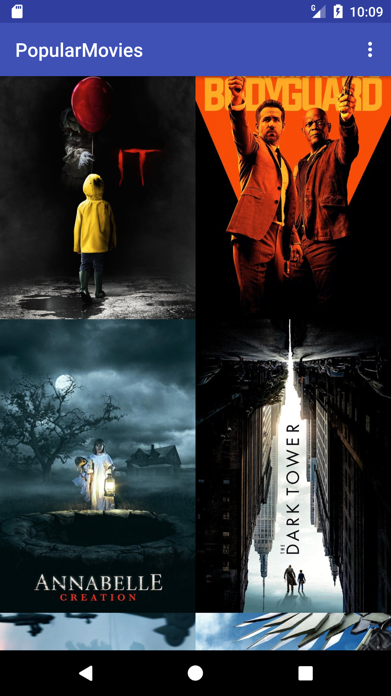
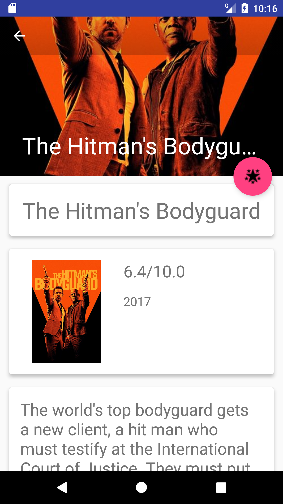
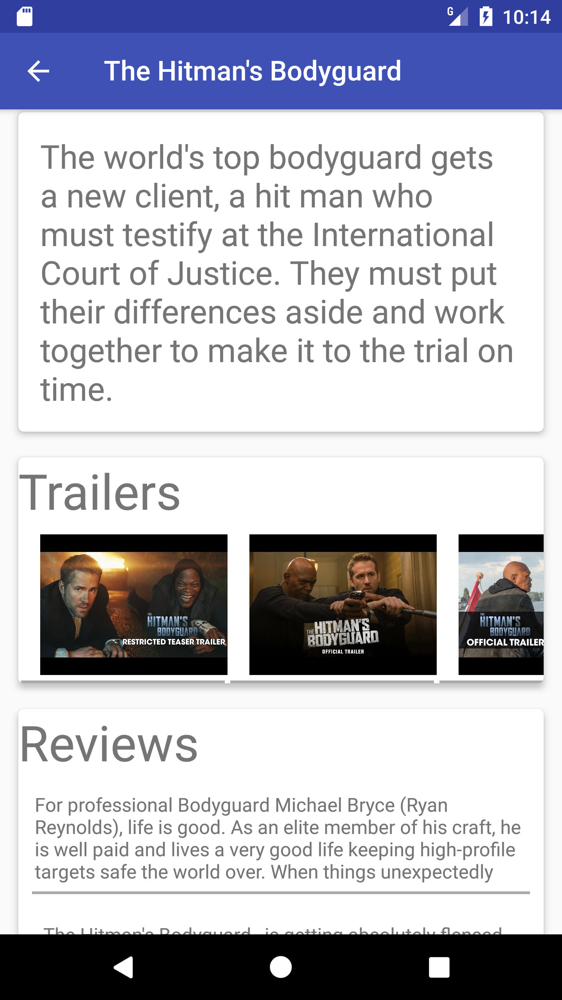
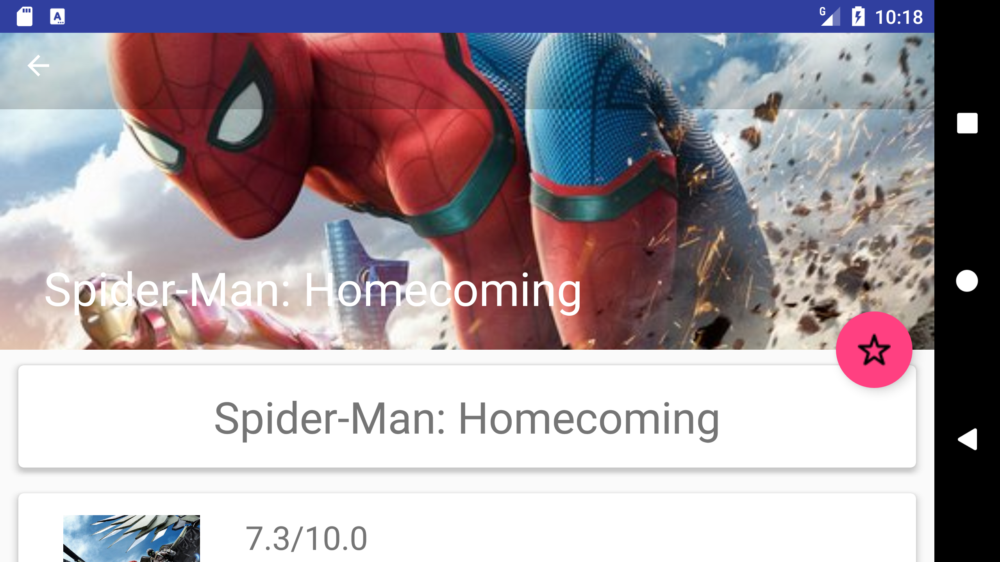
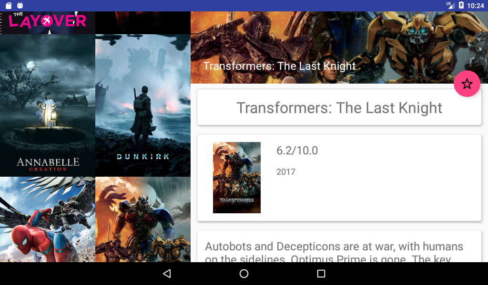

# Popular Movie App
Popular movie is the second project of Android nano degree from Udacity. The purpose of the project is to build an android application to show popular, top rated, and favorite movies by consuming the movie database REST api. In addition, the app is optimized for tablet with dual pane layout. The app displays a list of movies in a unlimited scrolling grid layout using RecyclerView, launches a detail screen whenever the users click a movie, allows the users to mark particular movies as favorite, view trailers with implicit intent, and caches movies into sqlite with content provider.











## Installation
1. Create an account in [the movie database api](https://www.themoviedb.org/documentation/api) and generate an API key.
2. Create an APIKey class with package org.jkarsten.popularmovie.popularmovies.data.source.remote
```java
package org.jkarsten.popularmovie.popularmovies.data.source.remote;
public class APIKey {
    public static final String API_KEY = "YOUR_API_KEY";
}
```
3. Build by using android studio. The minimum sdk version is 16 and the target sdk version is 25.

## Implementation
To implement the application, several supporting libraries are leveraged. Moreover, Model-View-Presenter architecture is applied to ensure the cleanness and maintainability of the code.

#### Supporting libraries
- [dagger](https://google.github.io/dagger/) for dependency injection
- [RxJava](https://github.com/ReactiveX/RxJava) for reactive programming
- [picasso](http://square.github.io/picasso/) for loading images from internet
- [okhttp](http://square.github.io/okhttp/) for network call

#### MVP architecture
MVP([Model-View-Presenter](https://stackoverflow.com/questions/2056/what-are-mvp-and-mvc-and-what-is-the-difference)) is an architecture with three components:
- Presenter contains the business logic for UI and communicates with View with an interface.
- View is responsible to receive commands from Presenter and show them to the UI.
- Model is used to manage data.

## License:
Popular movie application was created by Juan Karsten in 2017. It is a free software and may be distributed under [MIT License](https://opensource.org/licenses/MIT).
